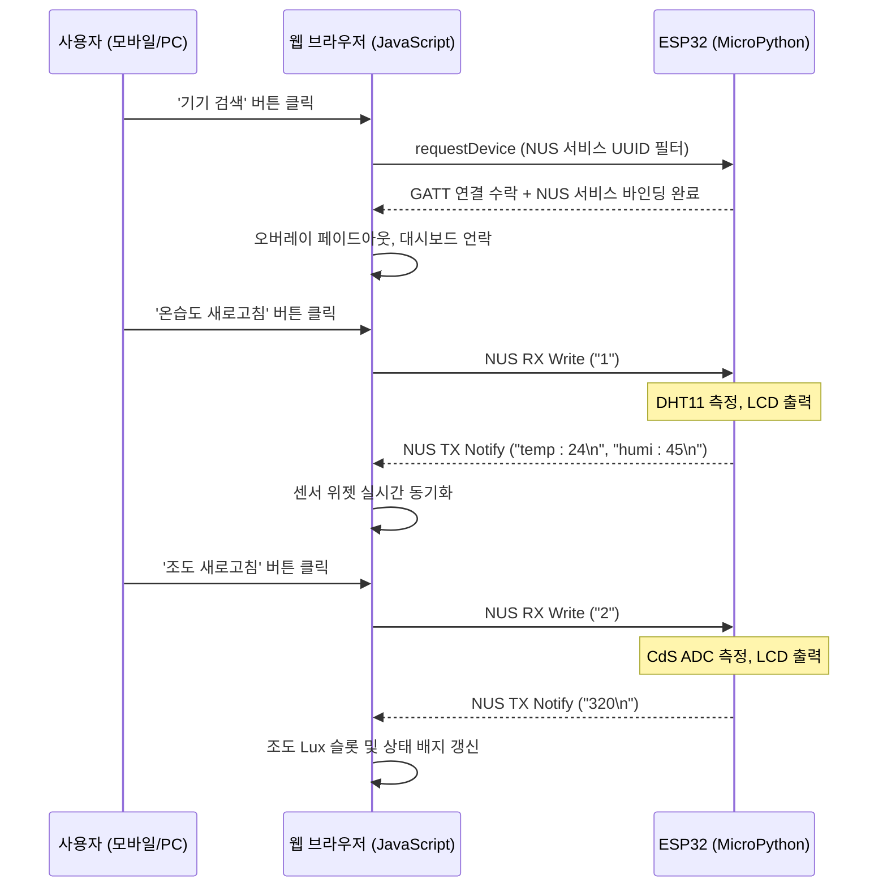

# 제품 요구사항 정의서 (PRD)
## ESP32 Snoopy Smart Home Dashboard — 웹 블루투스 컨트롤러

본 문서는 ESP32 스마트홈 하드웨어 키트와 Web Bluetooth API 간의 무선 블루투스 통신(Nordic UART Service, NUS)을 연동하고, 라이트 네오모피즘 스타일의 UI를 구현하기 위한 전체 시스템 사양서입니다.

처음 투입되는 개발자나 다른 작업자라 할지라도 **이 문서 한 장만으로 회로 구성, 블루투스 프로토콜, 패킷 규격, 디자인 규칙, 그리고 배포 절차**를 완전히 이해하고 동일한 웹 브라우저 제어 페이지를 처음부터 구현할 수 있습니다.

---

## 0. 배포 정보 (Deployment Info)

| 항목 | 정보 |
| :--- | :--- |
| **실시간 라이브 URL** | `https://smart-home-steel-eta.vercel.app` |
| **소스 코드 저장소** | `https://github.com/kara621621/SmartHome` |
| **배포 플랫폼** | Vercel (자동 HTTPS 제공) |
| **로컬 서버 실행** | `python -m http.server 8000 --directory <SmartHome 경로>` |

> [!IMPORTANT]
> Web Bluetooth API는 보안 정책에 의해 **반드시 HTTPS** 또는 **localhost** 환경에서만 동작합니다. `file:///` 로 직접 열면 작동하지 않습니다.

---

## 1. 하드웨어 시스템 사양 (Hardware Specifications)

스마트홈 피지컬 키트는 ESP32 DEVKIT V1(30핀) 마이크로컨트롤러를 기본 두뇌로 삼아 동작하며, 각 센서와 제어용 하드웨어의 핀 결선 맵은 다음과 같습니다.

### 1.1. 하드웨어 결선 핀 맵 (Pin Mapping)
| 하드웨어 컴포넌트 | 모델명 및 특성 | ESP32 GPIO 핀 연결 | 신호/입출력 유형 |
| :--- | :--- | :--- | :--- |
| **TTP 터치 센서** | TTP223 (4채널 터치 모듈) | D17(OUT1), D5(OUT2), D18(OUT3), D19(OUT4) | 디지털 입력 (HIGH 감지 시 구동) |
| **RGB LED** | 공통 캐소드(Cathode) RGB LED | D25(R), D26(G), D27(B) | 디지털 및 PWM 출력 |
| **CDS 조도 센서** | CdS 광도전 셀 (전압 분배 방식) | D36 (VP / ADC1_CH0) | 아날로그 입력 (ADC, ATTN_11DB) |
| **서보 모터** | SG90 마이크로 서보 | D13 | PWM 제어 출력 (기동 전류 주의) |
| **온습도 센서** | DHT11 디지털 온습도 센서 | D14 | 1-Wire 디지털 통신 |
| **피에조 부저** | 패시브 부저 (주파수 제어용) | D23 | PWM 주파수 톤 출력 |
| **16x2 I2C LCD** | HD44780 + PCF8574 어댑터 | D21(SDA), D22(SCL) 공유 | I2C 통신 (슬레이브 주소: `0x27`) |
| **I2C OLED** | SSD1306 (128x64 해상도) | D21(SDA), D22(SCL) 공유 | I2C 통신 (슬레이브 주소: `0x3C`) |

---

## 2. 블루투스 무선 통신 규격 (BLE NUS Specification)

웹 앱과 ESP32 디바이스는 **Nordic UART Service (NUS)** 전송 프로토콜을 사용해 양방향 데이터를 전송합니다.

### 2.1. NUS 서비스 및 특성 UUID 명세
- **NUS 서비스 UUID**: `6e400001-b5a3-f393-e0a9-e50e24dcca9e`
- **RX 특성 UUID (Write Without Response)**: `6e400002-b5a3-f393-e0a9-e50e24dcca9e`
  - 웹브라우저에서 명령어 패킷을 ESP32로 무선 전송할 때 사용합니다.
- **TX 특성 UUID (Notify)**: `6e400003-b5a3-f393-e0a9-e50e24dcca9e`
  - ESP32에서 센서 피드백을 웹브라우저로 전송할 때 사용합니다.

### 2.2. ESP32 블루투스 기기명 (Device Advertise Name)
- **현재 설정된 기기명**: `"ESP_ryun"`
- **펌웨어 설정 위치** (`smartHome.py` 60번째 줄):
  ```python
  p = ble_library.BLESimplePeripheral(ble, "ESP_ryun")
  ```

### 2.3. 무선 기기 스캔 방식 (Cross-Platform Compatible)

> [!IMPORTANT]
> **iOS(아이폰)** 환경에서 `namePrefix`만 단독으로 사용하면 작동하지 않습니다.
> MicroPython BLE는 기기명을 **Scan Response 패킷**에 담아 전송하는데, iOS Web Bluetooth(Bluefy)는 Scan Response를 읽지 못합니다.
> 이를 해결하기 위해 **NUS 서비스 UUID + namePrefix를 하나의 필터 객체에 AND 조건으로 결합**합니다.
> 서비스 UUID는 Advertising 패킷 본문에 실려있어 iOS에서도 기기를 탐지하고, namePrefix가 추가되어 `ESP_` 기기만 목록에 표시됩니다.

```javascript
// ✅ iOS / Android / PC 모두 호환되는 현재 스캔 방식
// 하나의 필터 객체 안에 두 조건 → AND 조건으로 동작
navigator.bluetooth.requestDevice({
    filters: [
        {
            services: ['6e400001-b5a3-f393-e0a9-e50e24dcca9e'], // NUS 서비스 UUID
            namePrefix: 'ESP_'                                   // 기기명 접두사
        }
    ]
});
// → NUS 서비스를 광고하면서 이름이 'ESP_'로 시작하는 기기만 검색 목록에 표시됩니다.
```

### 2.4. 모바일 기기별 지원 브라우저
| 플랫폼 | 사용 가능한 브라우저 | 비고 |
| :--- | :--- | :--- |
| **Android** | Chrome (기본 브라우저) | 근처 기기 / 위치 권한 허용 필요 |
| **iOS (아이폰)** | **Bluefy** (App Store 무료) | Safari는 Web Bluetooth 미지원 |
| **Windows/Mac** | Chrome, Edge | 별도 앱 불필요 |

---

## 3. 양방향 데이터 패킷 규격 (Data Packet Specifications)

### 3.1. 웹 ➡️ ESP32 명령어 규격
웹브라우저 버튼 클릭 시 ESP32의 `on_rx(v)` 콜백으로 무선 전달되는 ASCII 1글자 제어 코드입니다.

| 제어 문자 | 대상 컴포넌트 | 연동되는 피지컬 동작 |
| :---: | :--- | :--- |
| **`'1'`** | DHT11 온습도 센서 | 온습도 측정 → I2C LCD 출력 + 웹으로 블루투스 역송신 |
| **`'2'`** | CdS 조도 센서 | 조도 측정 → LCD 출력 + 웹으로 블루투스 역송신 |
| **`'3'`** | I2C LCD 백라이트 | `lcd.backlight_on()` — 액정 밝힘 |
| **`'4'`** | I2C LCD 백라이트 | `lcd.backlight_off()` — 액정 어둡게 |
| **`'5'`** | 피에조 부저 | 멜로디 1 (학교종이 땡땡땡) 연주 |
| **`'6'`** | 피에조 부저 | 멜로디 2 (반짝반짝 작은별) 연주 |
| **`'7'`** | RGB LED | D25, D26, D27 전체 HIGH → 점등 |
| **`'8'`** | RGB LED | D25, D26, D27 전체 LOW → 소등 |
| **`'9'`** | OLED 디스플레이 | `img/snoppy.pbm` 비트맵을 화면에 드로잉 |

### 3.2. ESP32 ➡️ 웹 센서 피드백 패킷 규격
ESP32가 `p.send(msg)` 로 웹 페이지에 보내는 메시지 형식입니다. 각 메시지 끝에 반드시 `\n` 구분자를 붙여야 합니다.

| 데이터 종류 | 전송 형식 | 웹 측 파싱 방법 |
| :--- | :--- | :--- |
| **온도** | `"temp : 24\n"` | `includes('temp')` 감지 후 숫자 추출 |
| **습도** | `"humi : 45\n"` | `includes('humi')` 감지 후 숫자 추출 |
| **조도** | `"320\n"` | `/^\d+$/` 정규식 통과 시 Lux 슬롯에 표시 |

---

## 4. 웹 애플리케이션 구조 (Web App Architecture)

### 4.1. 파일 구성
```
SmartHome/
├── index.html          # 단일 파일 웹 앱 (UI + BLE 스크립트 통합)
├── smartHome.py        # ESP32 MicroPython 펌웨어
├── Design.md           # 디자인 시스템 명세서
├── PRD.md              # 본 문서 (제품 요구사항 정의서)
├── README.md           # 프로젝트 소개
└── 스마트홈_회로연결.txt  # 하드웨어 배선 가이드
```

### 4.2. 기기 연결 UX 흐름 (App-like Connection Flow)
1. 앱 접속 시 **대형 기기 연결 팝업 오버레이**가 화면을 덮음 (대시보드는 블러 잠금 처리)
2. 중앙 **"기기 검색"** 원형 버튼(펄스 애니메이션 포함)을 눌러 BLE 스캔 팝업 호출
3. 스캔 리스트에서 `ESP_ryun` 기기 선택
4. 연결 성공 시 오버레이가 페이드아웃되며 대시보드 언락(Unlock) 활성화
5. 연결 해제 시 오버레이가 다시 나타나며 대시보드 재잠금

---

## 5. UI/UX 디자인 가이드라인 (Ambient Harmony Neumorphic Soft UI)

### 5.1. 컬러 토큰 (Color Tokens)
| 컬러명 | 헥사코드 | 용도 |
| :--- | :--- | :--- |
| **Base Surface** | `#f1f5f9` | 메인 배경, 네오모픽 카드 기본색 |
| **Highlight Bright** | `#ffffff` | 이중 광원의 좌상단 반사광 그림자 |
| **Shadow Dark** | `#cbd5e1` | 이중 광원의 우하단 어두운 그림자 |
| **Electric Blue** | `#2563eb` | BLE 연결 상태, 기본 포인트 컬러 |
| **Soft Amber** | `#f59e0b` | 조도 센서, LCD 백라이트 강조 |
| **Emerald Green** | `#10b981` | 부저 멜로디, 쾌적 신호 |
| **Rose Danger** | `#f43f5e` | 에러, 연결 끊김 상태 |

### 5.2. 입체 네오모피즘 그림자 공식 (CSS)
```css
/* Raised: 돌출된 카드, 평상시 버튼 */
box-shadow: 6px 6px 12px #cbd5e1, -6px -6px 12px #ffffff;

/* Sunken: 음각 패인 인풋, 터미널, 눌린 버튼 */
box-shadow: inset 4px 4px 8px #cbd5e1, inset -4px -4px 8px #ffffff;
```

### 5.3. UI 제어 문자 표시 금지 원칙
- 버튼 본문, 툴팁, 토스트 알림 등 **화면의 어떤 텍스트 영역에도 제어 코드(`'1'`, `'2'` 등)를 표시하지 않습니다.**
- 제어 문자는 JavaScript의 `actionMappings` 객체 내에서만 내부적으로 바인딩합니다.

---

## 6. 블루투스 시퀀스 흐름도 (BLE Communication Flow)



---

## 7. 배포 및 업데이트 절차 (Deployment Guide)

### 7.1. 최초 배포 (GitHub + Vercel 연동)
```bash
# 1. Git 초기화
git init
git add .
git commit -m "Initial commit"

# 2. GitHub 연결
git branch -M main
git remote add origin https://github.com/<사용자명>/SmartHome.git
git push -u origin main

# 3. Vercel CLI 배포
npx -y vercel --prod --yes
```

### 7.2. 코드 수정 후 재배포
```bash
git add .
git commit -m "변경 내용 설명"
git push
npx vercel --prod --yes
```

### 7.3. 롤백 방법
```bash
# 바로 직전 커밋으로 1단계 롤백
git revert HEAD --no-edit
git push
npx vercel --prod --yes
```

---

## 8. 보안 및 브라우저 실행 조건 (Security Constraints)

1. **보안 호스트 필수**: Web Bluetooth API는 반드시 **HTTPS** 또는 **`localhost` / `127.0.0.1`** 환경에서만 동작합니다.
2. **사용자 제스처 필수**: `requestDevice()` 호출은 반드시 버튼 클릭 이벤트 핸들러 내부에서 직접 호출되어야 합니다 (자동 실행 불가).
3. **iOS 주의사항**: 아이폰 Safari는 Web Bluetooth를 지원하지 않으므로 **Bluefy** 앱 사용이 필수입니다. 아이폰 설정 → Bluefy → 블루투스 권한을 반드시 **허용**으로 설정해야 합니다.
