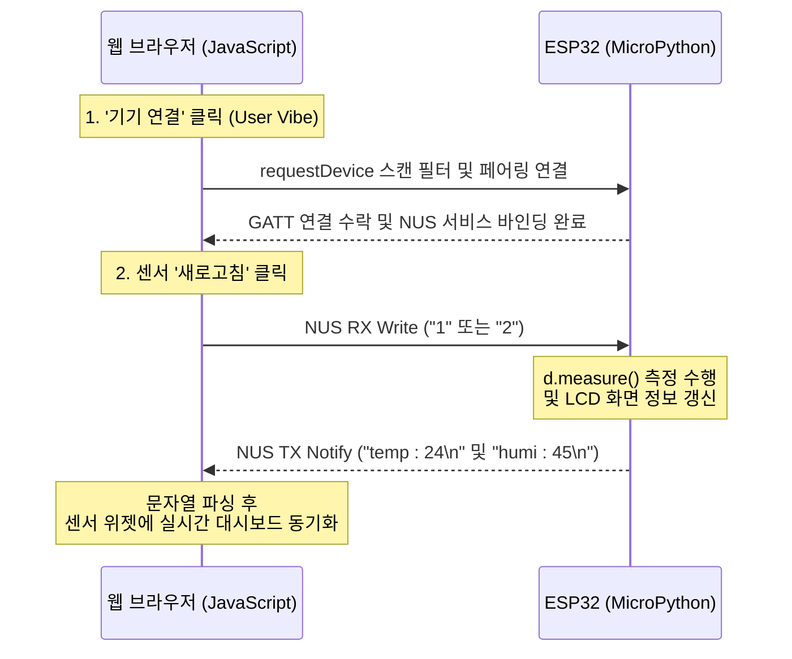

# 제품 요구사항 정의서 (PRD)
## ESP32 스마트홈 블루투스 컨트롤러 웹 애플리케이션

본 문서는 ESP32 스마트홈 하드웨어 키트와 Web Bluetooth API 간의 무선 블루투스 통신(Nordic UART Service, NUS)을 연동하고, 라이트 네오모피즘 스타일의 UI를 구현하기 위한 전체 시스템 사양서입니다. 

처음 투입되는 개발자나 다른 작업자라 할지라도 **이 문서 한 장만으로 회로 구성, 블루투스 프로토콜, 패킷 규격, 그리고 Neumorphic 디자인 규칙**을 완전히 이해하고 동일한 웹 브라우저 제어 페이지를 처음부터 구현할 수 있습니다.

---

## 1. 하드웨어 시스템 사양 (Hardware Specifications)

스마트홈 피지컬 키트는 ESP32 DEVKIT V1(30핀) 마이크로컨트롤러를 기본 두뇌로 삼아 동작하며, 각 센서와 제어용 하드웨어의 핀 결선 맵은 다음과 같습니다.

### 1.1. 하드웨어 결선 핀 맵 (Pin Mapping)
| 하드웨어 컴포넌트 | 모델명 및 특성 | ESP32 GPIO 핀 연결 | 신호/입출력 유형 |
| :--- | :--- | :--- | :--- |
| **TTP 터치 센서** | TTP223 (4채널 터치 모듈) | D33(OUT1), D32(OUT2), D35(OUT3), D34(OUT4) | 디지털 입력 (HIGH 감지 시 구동) |
| **RGB LED** | 공통 캐소드(Cathode) RGB LED | D25(R), D26(G), D27(B) | 디지털 및 PWM 출력 |
| **CDS 조도 센서** | CdS 광도전 셀 (전압 분배 방식) | D36 (VP / ADC1_CH0) | 아날로그 입력 (ADC) |
| **서보 모터** | SG90 마이크로 서보 | D13 | PWM 제어 출력 (기동 전류 주의) |
| **온습도 센서** | DHT11 디지털 온습도 센서 | D14 | 1-Wire 디지털 통신 |
| **피에조 부저** | 패시브 부저 (주파수 제어용) | D23 | PWM 주파수 톤 출력 |
| **16x2 I2C LCD** | HD44780 + PCF8574 어댑터 | D21(SDA), D22(SCL) 공유 | I2C 통신 (기본 슬레이브 주소: `0x27`) |
| **I2C OLED** | SSD1306 (128x64 해상도) | D21(SDA), D22(SCL) 공유 | I2C 통신 (기본 슬레이브 주소: `0x3C`) |

---

## 2. 블루투스 무선 통신 규격 (BLE NUS Specification)

웹 앱과 ESP32 디바이스는 가볍고 빠른 무선 스트리밍을 제공하는 **Nordic UART Service (NUS)** 전송 프로토콜을 사용해 양방향 데이터를 전송합니다.

### 2.1. NUS 서비스 및 특성 UUID 명세
- **NUS 서비스 UUID**: `6e400001-b5a3-f393-e0a9-e50e24dcca9e`
- **RX 특성 UUID (Write Without Response)**: `6e400002-b5a3-f393-e0a9-e50e24dcca9e`
  - 웹브라우저에서 명령어 문자열 패킷을 ESP32 보드로 무선 전송할 때 사용합니다.
- **TX 특성 UUID (Notify)**: `6e400003-b5a3-f393-e0a9-e50e24dcca9e`
  - ESP32 보드에서 실시간 측정된 센서 피드백을 웹브라우저 측으로 전송할 때 사용합니다.

### 2.2. 무선 기기 스캔 및 필터링
- 사용자 환경에서 블루투스 검색 창을 띄울 때 무관한 타 장비들이 검색되지 않도록 엄격한 필터링 정책을 적용합니다.
- **기기명 접두사 (Name Prefix)**: `'ESP_'` (예: ESP_로 시작하는 칩셋만 검색창에 노출)
- **자바스크립트 스캔 설정 코드 예시**:
  ```javascript
  navigator.bluetooth.requestDevice({
      filters: [{ namePrefix: 'ESP_' }],
      optionalServices: ['6e400001-b5a3-f393-e0a9-e50e24dcca9e']
  });
  ```

---

## 3. 양방향 데이터 패킷 규격 (Data Packet Specifications)

### 3.1. 웹 ➡️ ESP32 명령어 규격
웹브라우저의 각 UI 버튼 클릭 시 ESP32의 블루투스 수신 이벤트 콜백 함수(`on_rx(v)`)로 무선 전달되는 ASCII 1글자 제어 코드입니다.

| 제어 문자 | 대상 컴포넌트 | 연동되는 피지컬 동작 |
| :---: | :--- | :--- |
| **'1'** | DHT11 온습도 센서 | 온습도를 측정하여 I2C LCD에 표시하고, 그 값을 웹 브라우저로 블루투스 역송신 |
| **'2'** | CdS 조도 센서 | 아날로그 전압을 읽어 LCD에 표시하고, 그 전압값을 웹 브라우저로 블루투스 역송신 |
| **'3'** | I2C LCD 무드등 | LCD 백라이트 전원을 공급하여 액정을 밝힙니다 (`lcd.backlight_on()`) |
| **'4'** | I2C LCD 무드등 | LCD 백라이트 전원을 차단하여 액정을 어둡게 만듭니다 (`lcd.backlight_off()`) |
| **'5'** | 피에조 부저 | 멜로디 1 (학교종이 땡땡땡) 연주 주파수 스트림을 시작합니다 |
| **'6'** | 피에조 부저 | 멜로디 2 (반짝반짝 작은별) 연주 주파수 스트림을 시작합니다 |
| **'7'** | RGB LED 전등 | D25, D26, D27 핀을 모두 출력 HIGH 상태로 점등합니다 (전체 On) |
| **'8'** | RGB LED 전등 | D25, D26, D27 핀을 모두 출력 LOW 상태로 소등합니다 (전체 Off) |
| **'9'** | OLED 디스플레이 | 플래시 파일 시스템에서 스누피(`snoppy.pbm`) 비트맵 버퍼를 읽어 화면에 드로잉 |

### 3.2. ESP32 ➡️ 웹 센서 피드백 패킷 규격
ESP32 하드웨어가 센서 값을 측정하여 웹 페이지에 동적으로 반영하기 위해 블루투스 TX 채널(`p.send(msg)`)로 송신하는 데이터 형식입니다. 패킷의 완결성을 보증하기 위해 각 메시지의 끝에는 반드시 줄바꿈 기호(`\n`) 또는 EOT 기호(`\x04`)를 붙여야 합니다.

1. **온도 데이터**: `"temp : [정수값]\n"` (예: `"temp : 24\n"`)
   - 웹 측은 `includes('temp')` 판정 시 숫자를 정규식 추출해 온도 슬롯을 동기화합니다.
2. **습도 데이터**: `"humi : [정수값]\n"` (예: `"humi : 45\n"`)
   - 웹 측은 `includes('humi')` 판정 시 숫자를 정규식 추출해 습도 슬롯을 동기화합니다.
3. **조도 데이터**: `"[조도정수값]\n"` (예: `"320\n"`)
   - 웹 측은 숫자로만 구성된 메시지가 들어오면 정규식 `/^\d+$/` 테스트를 통과시켜 조도 Lux 슬롯을 동기화하고, 수치 판정에 따라 "어두움"/"쾌적함" 배지 텍스트를 제어합니다.

---

## 4. UI/UX 디자인 가이드라인 (Ambient Harmony Neumorphic Soft UI)

사용자가 스마트홈 컨트롤러 웹 어플리케이션을 실행했을 때 우아하고 미려한 평온함을 경험할 수 있도록, **라이트 소프트 네오모피즘(Neumorphic Soft UI)** 테마를 필수로 구현합니다.

### 4.1. 컬러 스키마 (Color Schemes)
- **기본 배경 캔버스**: `#f1f5f9` (부드러운 미색 슬레이트 그레이)
- **카드 및 플레이트 표면**: `#f7f9fb`
- **핵심 Electric Blue (Primary)**: `#2563eb` (블루투스 제어 및 연결 상태 포인트)
- **따뜻한 Amber (Secondary)**: `#f59e0b` (무드등 지시 및 조도 센서 관련 강조)
- **선명한 Emerald Green (Tertiary)**: `#10b981` (부저 멜로디 및 쾌적 신호 강조)
- **비활성 텍스트 / 그림자 대조군**: `#cbd5e1`

### 4.2. 입체 네오모피즘 그림자 공식 (Dual-Light Source Shadow CSS)
네오모피즘의 핵심인 이중 광원 시뮬레이션(좌측 상단 백색 반사광, 우측 하단 어두운 그림자) 효과를 구현하기 위한 CSS 공식입니다.

- **Raised Plate (돌출된 기본 카드, 평상시 상태의 버튼)**:
  ```css
  background: #f1f5f9;
  border: 1px solid #e2e8f0;
  border-radius: 16px; /* 모서리는 1rem(16px) 둥글기를 일괄 적용하여 부드러운 하우징 묘사 */
  box-shadow: 6px 6px 12px #cbd5e1, -6px -6px 12px #ffffff;
  ```
- **Sunken Well (음각 처리된 터미널 패널, 클릭/활성화 상태의 버튼)**:
  ```css
  background: #f1f5f9;
  border: 1px solid #e2e8f0;
  box-shadow: inset 4px 4px 8px #cbd5e1, inset -4px -4px 8px #ffffff;
  ```

### 4.3. UI 제어 문자 가시성 통제 가이드라인 (UI Cleanliness Rule)
- **경고**: 일반 사용자 및 교육생이 직관적으로 제어할 수 있도록, **웹 UI 버튼 본문, 새로고침 툴팁(`title`), 작동 확인 토스트 알림 등 화면의 모든 텍스트 영역에서 `보내는 문자: 'X'`, `(값: X)` 등의 로우(Raw) 제어 코드 표기는 완전히 배제하고 숨겨야 합니다.**
- 제어 문자는 사용자 화면에 보이지 않고 백그라운드 스크립트 단의 블루투스 전송 함수(`sendControlData`) 매핑 객체 내에서만 조용히 바인딩되어 처리되어야 합니다.

---

## 5. 블루투스 시퀀스 흐름도 (BLE Communication Logic Flow)



---

## 6. 보안 및 브라우저 실행 조건 (Security Constraints)

1. **보안 호스트 필수**: Web Bluetooth API는 브라우저 보안 규정에 의해 반드시 **HTTPS 환경** 또는 로컬 보안 호스트 도메인인 **`localhost` (또는 `127.0.0.1`)**를 통해서 웹 서버를 실행하여 접근해야 합니다. (`file:///` 주소로 직접 열었을 때는 작동하지 않습니다.)
2. **사용자 액션 제스처**: 블루투스 기기 찾기 팝업 호출 함수(`requestDevice`)는 반드시 버튼 클릭(`click` 이벤트 수신 핸들러) 등 실제 사용자의 물리 입력 이벤트 내부 컨텍스트에서 직접 호출되도록 구조화해야 합니다.
